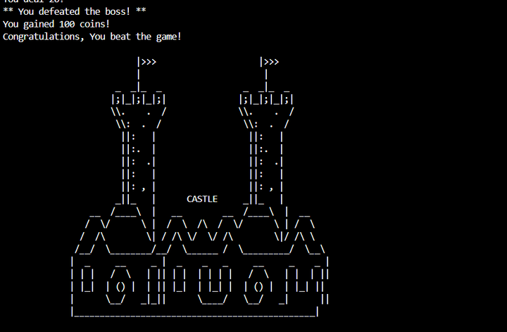

# Castle-of-the-Hack-Lords

A simple **text-based RPG game in C++** where you explore a mysterious castle, fight Hack Clubbers, and collect coins to survive the adventure.  

---

## Storyline  
You are a brave adventurer who dares to enter the **Castle of Hackers**.  
Inside, you’ll encounter **Hack Clubbers** guardians of the castle who test your courage.  

- ⚔️ Fight enemies to earn coins (but risk losing health).  
- 🏃 Run away to save health (but earn nothing).  

Survive all castle rooms to win the game!  

---

## Features  
- **Player System**: Name, health, and coins tracking.  
- **Enemies (Hack Clubbers)**: Random attack power & random coin drops.  
- **Choices**: Fight or run in every room.  
- **Randomization**: Each playthrough is unique.  
- **Game Endings**: Win by surviving or lose if your health hits zero.  

---
## How to Play

### 1. Compile the game
```bash
g++ main.cpp -o main


===== CASTLE ADVENTURE RPG =====

                          |>>>                    |>>>
                          |                        |
                      _  _|_  _                _  _|_  _
                     |;|_|;|_|;|              |;|_|;|_|;|
                     \\.    .  /              \\.    .  /
                      \\:  .  /                \\:  .  /
                       ||:   |                  ||:   |
                       ||:.  |                  ||:.  |
                       ||:  .|                  ||:  .|
                       ||:   |      CASTLE      ||:   |
                       ||: , |                  ||: , |
                      _||_   |                  _||_   |
                 __  /____\  |   __        __  /____\  |  __
                /  \/      \ |  /  \  /\  /  \/      \ | /  \
               /  /\        \| / /\ \/  \/ /\        \|/ /\ \
              /__/  \________/__/  \______ /  \_________/  \__\
             |  _     __     _ |  _    _   _     __     _    _ |
             | | |   /  \   | || | |  | | | |   /  \   | |  | ||
             | |_|  | () |  | || |_|  | |_| |  | () |  | |_| ||
             |      \__/   _|_||      \____/   \__/   _|      ||
             |_______________________________________________|

```
## 💰 Coin System

Coins are an important part of the game.  
Players can **earn coins** and **spend them in the shop** for survival and upgrades.

### How to Get Coins
- Winning battles against enemies  
- Discovering treasure rooms  
- Receiving random gifts from NPCs  
- Exploring special rooms that grant coin rewards  

### How to Use Coins
Coins can be spent in the **Shop**:
- Buy **Potions** to restore health during fights  
- Pay for **Healing** to regain HP instantly  
- Upgrade your **Sword** to deal more damage  

### Strategy Tip
- Save coins early on for healing and potions.  
- Investing in a **Sword Upgrade** before the final boss increases your chance of victory.  

# 🏰 Castle Adventure RPG


A simple **text-based RPG** made with **C++**.  
You explore a mysterious castle, collect coins, fight enemies, and prepare for the final boss battle.  

---

##  Winning the Game
When you defeat the final boss and survive the castle, the game displays a **winning message** like this:

### Example Screenshot



